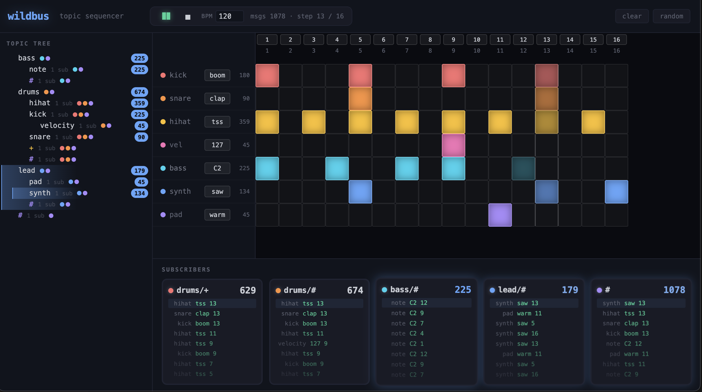

# wildbus

Typed topic-based pub/sub with MQTT-style wildcards for complex UIs. Zero dependencies.

```ts
import { WildBus } from 'wildbus';

const bus = new WildBus();

// Subscribe with + (single-level) and # (multi-level) wildcards
bus.subscribe<User>('users/+/status', (user, topic) => {
  console.log(`${user.name} changed status`);
});

bus.publish<User>('users/42/status', { id: 42, name: 'Alice' });
```

## Demo

The repo includes an interactive sequencer demo that visualizes topic routing in real time — think drum machine meets pub/sub.

**[Live demo →](https://dmytro-kopylov-personal.github.io/wildbus/)**

```
cd demo && npm install && npm run dev
```



- **6 tracks × 16 steps** — each track publishes to a topic (`drums/kick`, `lead/synth`, …)
- **Wildcard subscribers** — watch `drums/+` vs `drums/#` diverge as nested topics fire
- **Live topic tree** — hit-count badges show which branches are hot, paths highlight on each message
- **Counters** — per-track and per-subscriber message tallies
- Click cells while playing, randomize the grid, adjust BPM, or hit spacebar to start/stop

The demo uses wildbus itself — same zero-dependency library, no framework.

## Install

```bash
npm install wildbus
```

## API

### `subscribe<T>(topic, listener) => Unsubscribe`

Register a listener for a topic pattern. Returns a function that unsubscribes when called.

**Wildcards:**
- `+` matches exactly one level (`users/+/status` matches `users/42/status`)
- `#` matches zero or more levels and must be the final segment (`log/#` matches `log`, `log/error`, `log/error/db`)

### `publish<T>(topic, payload)`

Send a payload to all listeners whose subscription matches the topic. If a listener throws, delivery continues to remaining listeners — the error goes to `onError` if configured, or `console.error`.

### `onError(handler)`

Register a handler for listener exceptions: `(err, topic, listener) => void`.

### `unsubscribe(topic, listener)`

Remove a specific listener from a specific topic.

### `removeListener(listener)`

Remove a listener from **all** topics it's subscribed to.

### `listenerCount`

Total number of registration entries.

### `clear()`

Remove all subscriptions.

## How it works

Wildbus stores subscriptions in a **topic trie**. Each node has three kinds of children:

```
node
├── children: Map<segment, node>   // exact literal match
├── plus: node | null              // + matches one level
└── hash: node | null              // # matches zero or more
└── listeners: Set<fn>             // subscribers at this node
```

When you publish to `drums/kick`, the trie does a recursive fan-out from the root:

```
publish("drums/kick")
  ├── exact: children["drums"] → children["kick"] → collect listeners
  ├── plus:  if node.plus → recurse, consuming one level
  └── hash:  if node.hash → collect listeners now (zero levels) AND recurse
```

A single publish hits exact matches, single-level wildcards, and multi-level wildcards in one traversal. Results land in a `Set`, so a listener subscribed to both `drums/+` and `drums/#` only fires once.

The bus wrapper adds type generics, error isolation (one broken listener can't kill delivery), and idempotent unsubscribe.

## Why not EventEmitter?

Wildbus routes by **topic pattern**, not channel name. One publish can hit subscribers on `exact/match`, `category/+`, and `root/#` — all in a single call. That composability is what makes it useful for complex UIs where components care about overlapping slices of the state tree.

## License

MIT
